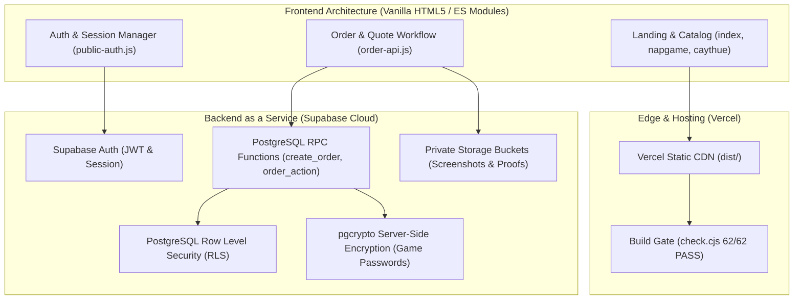
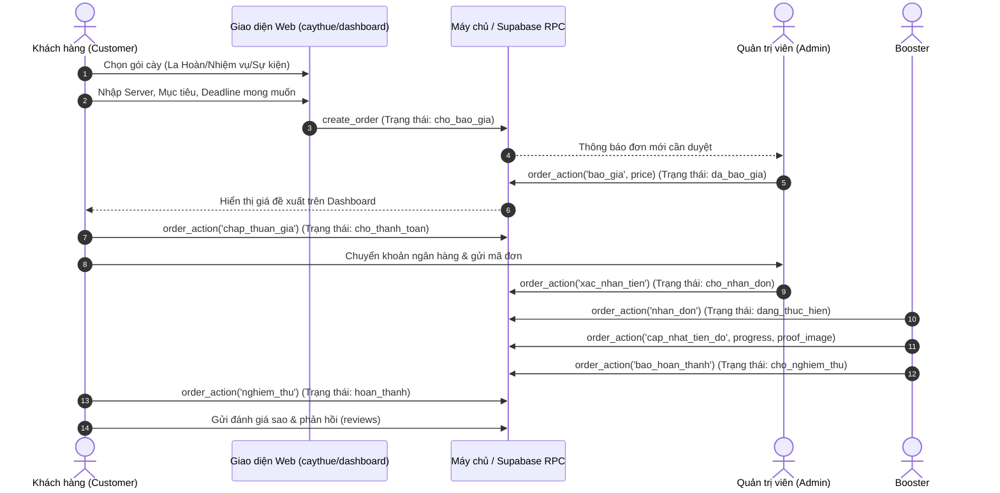
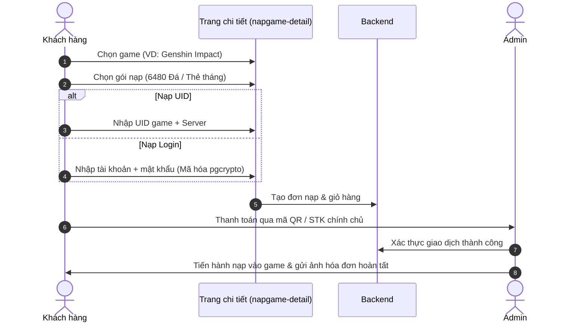

# 📋 BỘ HỒ SƠ TỔNG HỢP TOÀN DIỆN DỰ ÁN WEBSITE NAMCUMZ
### *Tài liệu đánh giá & thẩm định chuyên môn (Website Audit & Review Dossier)*

---

## 📌 1. THƯ NGỎ GỬI CHUYÊN GIA (COVER LETTER)

**Kính gửi Chuyên gia / Đơn vị thẩm định,**

Tài liệu này tổng hợp toàn bộ thông tin kiến trúc, giao diện, tính năng, tài nguyên hình ảnh và luồng vận hành của nền tảng **Namcumz** ([https://namcumz.io.vn/](https://namcumz.io.vn/)).

- **Tên dự án:** Namcumz — Game Top-up & Boosting Service Platform
- **Website chính thức:** [https://namcumz.io.vn/](https://namcumz.io.vn/)
- **Lĩnh vực:** Dịch vụ nạp tiền tệ game (In-game Currency Top-up) & Dịch vụ cày thuê/hỗ trợ tài khoản game (Game Boosting / Account Farming).
- **Thị trường mục tiêu:** Game thủ các tựa game Gacha thế giới mở hàng đầu tại Việt Nam: *Genshin Impact*, *Honkai: Star Rail*, *Zenless Zone Zero* (HoYoverse) và *Wuthering Waves* (Kuro Games).
- **Mục tiêu yêu cầu đánh giá:**
  1. **UI/UX & Trải nghiệm đa nền tảng:** Đánh giá tính thẩm mỹ phong cách Dark Gaming, hệ thống typography, micro-interactions và độ mượt mà trên Mobile (390px, 768px, 1280px+).
  2. **Tỷ lệ chuyển đổi (CRO) & Luồng đặt hàng:** Phân tích phễu khách hàng từ Trang chủ → Xem catalog → Chọn gói / Tạo yêu cầu báo giá → Chốt thanh toán.
  3. **Kiến trúc kỹ thuật & An toàn thông tin:** Thẩm định giải pháp kiến trúc Lightweight Vanilla Frontend + Supabase PostgreSQL Backend, phân quyền RLS và cơ chế mã hóa mật khẩu tài khoản game bằng PGP (pgcrypto).
  4. **Độ tin cậy & Tín hiệu thương hiệu (Trust Signals):** Đánh giá các trang Check Scam, Đánh giá đơn hàng (Reviews), Điều khoản và Chính sách bảo mật.

---

## 🌐 2. DANH MỤC TRANG WEB & TÍNH NĂNG (SITEMAP & PAGE DIRECTORY)

Hệ thống bao gồm **14 phân hệ trang** phục vụ 3 nhóm đối tượng: Khách vãng lai (Guest), Khách hàng thành viên (Customer), Đội ngũ cày thuê (Booster) và Quản trị viên (Admin).

| STT | Trang | Đường dẫn Live | Đối tượng | Mô tả tính năng chính |
|---|---|---|---|---|
| 1 | **Trang chủ (Homepage)** | [`namcumz.io.vn/`](https://namcumz.io.vn/) | Công khai | Banner video gaming cinematic, bảng xếp hạng Top Booster hoàn thành đơn, 4 thẻ game nạp nổi bật, gói cày thuê tiêu biểu, lời chứng thực khách hàng và liên kết mạng xã hội. |
| 2 | **Danh mục Nạp Game** | [`/napgame.html`](https://namcumz.io.vn/napgame.html) | Công khai | Catalog hiển thị toàn bộ 4 tựa game hỗ trợ, phân loại theo nhà phát hành, bộ lọc tìm kiếm và bảng cam kết quyền lợi nạp game. |
| 3 | **Chi tiết Nạp Game** | [`/napgame-detail.html`](https://namcumz.io.vn/napgame-detail.html?game=genshin) | Khách hàng | Bộ chọn gói nạp tương tác (Đá/Vé tháng), chọn hình thức Nạp qua UID hoặc Nạp Login, tính toán giá tự động, form nhập thông tin bảo mật và giỏ hàng. |
| 4 | **Dịch vụ Cày Thuê** | [`/caythue`](https://namcumz.io.vn/caythue) | Khách hàng | 6 phân mục dịch vụ cày thuê trọng tâm (La Hoàn, Khám Phá, Nhiệm Vụ, Sự Kiện, Build Nhân Vật, Yêu Cầu Riêng), kích hoạt modal gửi yêu cầu báo giá chuẩn. |
| 5 | **Bảng điều khiển Khách** | [`/dashboard.html`](https://namcumz.io.vn/dashboard.html) | Khách hàng | Quản lý vòng đời đơn hàng: Theo dõi tiến độ đơn cày thuê/nạp, xem báo giá, xác nhận giá, xem hướng dẫn chuyển khoản, chat trực tiếp theo mã đơn và nghiệm thu. |
| 6 | **Hồ sơ Cá nhân** | [`/profile.html`](https://namcumz.io.vn/profile.html) | Thành viên | Thông tin tài khoản, danh sách đơn hàng đã thực hiện, điều hướng chi tiết đơn hàng, cài đặt bảo mật và đổi mật khẩu. |
| 7 | **Cổng Đăng nhập/Đăng ký** | [`/login.html`](https://namcumz.io.vn/login.html) | Mọi vai trò | 3 phân hệ đăng nhập trong 1 giao diện: Đăng nhập khách, Đăng ký thành viên, Cổng đăng nhập cho Booster/Admin kèm background art riêng biệt. |
| 8 | **Quản trị Shop (Admin)** | [`/admin.html`](https://namcumz.io.vn/admin.html) | Admin | Điều phối toàn bộ hoạt động shop: Quản lý danh sách đơn, báo giá đơn cày thuê, phê duyệt thanh toán, phân bổ đơn cho booster và kiểm duyệt review. |
| 9 | **Không gian Booster** | [`/booster.html`](https://namcumz.io.vn/booster.html) | Booster | Xem danh sách đơn đang chờ nhận, tiếp nhận đơn, cập nhật % tiến độ hoàn thành, đăng tải hình ảnh bằng chứng hoàn tất và nhắn tin hỗ trợ khách. |
| 10 | **Kiểm tra Uy tín / Check Scam** | [`/checkscam.html`](https://namcumz.io.vn/checkscam.html) | Công khai | Công khai danh tính tài khoản nhận tiền chính thức, link Zalo/Facebook duy nhất của chủ shop, danh sách cảnh báo lừa đảo giả mạo và hướng dẫn giao dịch an toàn. |
| 11 | **Đánh giá Khách hàng** | [`/reviews.html`](https://namcumz.io.vn/reviews.html) | Công khai | Hệ thống đánh giá sao và nhận xét thực tế từ khách hàng sau khi đơn hoàn thành nghiệm thu. |
| 12 | **Hỏi đáp thường gặp (FAQ)** | [`/faq.html`](https://namcumz.io.vn/faq.html) | Công khai | Giải đáp chi tiết các thắc mắc phổ biến về thời gian hoàn thành đơn, an toàn tài khoản game, quy định nạp UID vs Login. |
| 13 | **Lưu ý & Hướng dẫn** | [`/luu-y.html`](https://namcumz.io.vn/luu-y.html) | Công khai | Hướng dẫn khách hàng chuẩn bị trước khi giao tài khoản (bật xác thực 2 bước, hủy liên kết thiết bị lạ, đổi mật khẩu sau khi nghiệm thu). |
| 14 | **Điều khoản & Bảo mật** | [`/terms.html`](https://namcumz.io.vn/terms.html) & [`/privacy.html`](https://namcumz.io.vn/privacy.html) | Công khai | Quy định pháp lý về giao dịch, chính sách hoàn tiền, giới hạn trách nhiệm và cam kết bảo vệ dữ liệu người dùng. |

---

## 🎨 3. BẢNG KIỂM KÊ HÌNH ẢNH & VISUAL ASSETS (MEDIA INVENTORY)

Toàn bộ hệ thống hình ảnh được chuẩn hóa theo định dạng **WebP tối ưu nén**, progressive loading, bảo đảm điểm Core Web Vitals cao và thời gian tải dưới 1.5s trên mạng di động 4G.

### 3.1. Thương hiệu & Giao diện nền (Brand & Hero)
- **Logo thương hiệu chính thức:**
  - Đường dẫn WebP: `assets/images/logo.webp` (14 KB, 512×512px)
  - Đường dẫn JPEG dự phòng: `assets/images/logo.jpg` (53 KB, 1024×1024px)
- **Hero Video & Poster (Trang chủ):**
  - Video Desktop (720p 60fps loop, không tiếng): `assets/videos/hero/hero-video-desktop.mp4` (~2.8 MB)
  - Video Mobile (360p tối ưu): `assets/videos/hero/hero-video-mobile.mp4` (~576 KB)
  - Poster tĩnh (Fallback khi tiết kiệm pin/mạng yếu): `assets/videos/hero/hero-poster.webp` (178 KB)
- **Video hiệu ứng phụ trợ:**
  - `assets/videos/genshin-teyvat-ambient.mp4` (Ambient Teyvat)
  - `assets/videos/hsr-astral-warp.mp4` (Hiệu ứng Astral Warp)
  - `assets/videos/topup-crystal-aura.mp4` (Aura tiền tệ game)

### 3.2. Ảnh đại diện 4 tựa Game cốt lõi
| Tựa game | App Icon chính thức (256×256 WebP) | Banner phong cảnh (1200×450 JPG) | Card danh mục (480×600 JPG) |
|---|---|---|---|
| **Genshin Impact** | `assets/images/games/genshin_icon.webp` (17 KB) | `assets/images/games/genshin_banner.jpg` (127 KB) | `assets/images/games/genshin_card.jpg` (68 KB) |
| **Honkai: Star Rail** | `assets/images/games/hsr_icon.webp` (19 KB) | `assets/images/games/hsr_banner.jpg` (144 KB) | `assets/images/games/hsr_card.jpg` (82 KB) |
| **Zenless Zone Zero** | `assets/images/games/zzz_icon.webp` (13 KB) | `assets/images/games/zzz_banner.jpg` (113 KB) | `assets/images/games/zzz_card.jpg` (51 KB) |
| **Wuthering Waves** | `assets/images/games/wuwa_icon.webp` (15 KB) | `assets/images/games/wuwa_banner.jpg` (76 KB) | `assets/images/games/wuwa_card.jpg` (48 KB) |

### 3.3. Artwork Tiền tệ & Gói nạp theo từng bậc (Tiered Currency Packages)
Mỗi game có trọn bộ artwork biểu thị chính xác số lượng tiền tệ tăng dần (từ 60 đến 6480 đơn vị) kèm thẻ tháng và Battle Pass:

- **Genshin Impact (Đá Sáng Thế / Genesis Crystals):**
  - Vé tháng Không Nguyệt Chúc Phúc: `assets/images/games/welkin.webp` (10 KB)
  - 60 Đá: `assets/images/games/crystals_60.webp` (4 KB)
  - 300 Đá: `assets/images/games/crystals_300.webp` (5 KB)
  - 980 Đá: `assets/images/games/crystals_980.webp` (7 KB)
  - 1980 Đá: `assets/images/games/crystals_1980.webp` (8 KB)
  - 3280 Đá: `assets/images/games/crystals_3280.webp` (10 KB)
  - 6480 Đá: `assets/images/games/crystals_6480.webp` (12 KB)
- **Honkai: Star Rail (Mộng Cảnh / Oneiric Shards):**
  - Thẻ tháng Express Supply Pass: `assets/images/games/hsr_pass.webp` (12 KB)
  - Nameless Glory (Battle Pass): `assets/images/games/hsr_bp.webp` (8 KB)
  - Các mốc 60, 300, 980, 1980, 3280, 6480 Mộng Cảnh: `assets/images/games/hsr_{60..6480}.webp` (4–12 KB)
- **Zenless Zone Zero (Monochrome):**
  - Thẻ tháng Inter-Knot Membership: `assets/images/games/zzz_pass.webp` (8 KB)
  - Các mốc 60, 300, 980, 1980, 3280, 6480 Monochrome: `assets/images/games/zzz_{60..6480}.webp` (3–13 KB)
- **Wuthering Waves (Lunite):**
  - Thẻ tháng Lunite Subscription: `assets/images/games/wuwa_pass.webp` (13 KB)
  - Các mốc 60, 300, 980, 1980, 3280, 6480 Lunite: `assets/images/games/wuwa_{60..6480}.webp` (5–15 KB)

### 3.4. Key Art Cổng Đăng nhập (Auth Side-panel Visuals)
- Đăng nhập khách hàng (Genshin Theme): `assets/images/auth/customer-login.webp` (96 KB)
- Đăng ký thành viên (Astral Express HSR Theme): `assets/images/auth/customer-register.webp` (128 KB)
- Cổng Booster / Admin (Wuthering Waves Resonator Theme): `assets/images/auth/booster-login.webp` (62 KB)

### 3.5. Hệ thống màu sắc & Design System Tokens
- **Nền chính (Deep Space Dark):** `--bg-primary: #0a0b0e`, `--bg-secondary: #12131a`, `--bg-card: rgba(18, 19, 26, 0.75)`
- **Điểm nhấn Neon (Gaming Accents):**
  - Neon Cyan (Thanh thoát, công nghệ): `--neon-cyan: #00f0ff`
  - Deep Violet (Huyền bí, sang trọng): `--neon-purple: #7928ca`
  - Electric Gold (Tiền tệ, VIP, Cảnh báo): `--gold-accent: #ffb800`
- **Typography:** Inter & Outfit (Google Fonts), tối ưu độ tương phản AAA theo chuẩn WCAG 2.1.

---

## ⚙️ 4. KIẾN TRÚC KỸ THUẬT & AN TOÀN HỆ THỐNG (TECH STACK & SECURITY)



### 4.1. Công nghệ phía Frontend
- **Không phụ thuộc Framework cồng kềnh:** Sử dụng HTML5 thuần chuẩn SEO, CSS Grid/Flexbox phân tầng module, và JavaScript hiện đại (ES Modules). Tốc độ tải lần đầu (First Contentful Paint) đạt < 0.8s.
- **Bảo vệ DOM & Chống tấn công XSS:** Tuyệt đối không dùng `eval()` hoặc gán `innerHTML` bừa bãi với dữ liệu người dùng. Dữ liệu chat, tên tài khoản, nội dung đơn hàng đều qua cơ chế Text Node encoding an toàn.

### 4.2. Cơ sở Dữ liệu & Xử lý Nghiệp vụ Backend (Supabase PostgreSQL)
- **Row Level Security (RLS):** Bắt buộc ở mức database. Khách hàng A tuyệt đối không thể đọc hay can thiệp vào đơn hàng, ghi chú hay thông tin game của khách hàng B.
- **Kiểm soát phân quyền theo vai trò (RBAC):** Bốn nhóm vai trò rõ ràng (`customer`, `booster`, `admin`, `super_admin`) được xác thực hoàn toàn trên máy chủ, chặn đứng hành vi sửa client để nâng quyền.
- **Mã hóa Mật khẩu Tài khoản Game (End-to-End Credential Encryption):**
  - Khi khách đặt dịch vụ yêu cầu đăng nhập tài khoản game, mật khẩu được mã hóa ngay tại server bằng `pgcrypto`.
  - Không lưu trữ mật khẩu ở dạng văn bản thuần (plaintext) trong database.
  - Chỉ admin và booster được phân công chính thức cho đơn hàng mới có khóa giải mã tạm thời khi tiến hành đăng nhập thực hiện dịch vụ.
- **Cơ chế Idempotency & Chống gửi trùng:** `order-api.js` tạo mã request ID riêng cho từng thao tác, vô hiệu hóa nút bấm và chống double-click khi đang gửi yêu cầu tạo đơn.

---

## 🔄 5. LUỒNG NGHIỆP VỤ CỐT LÕI (CORE BUSINESS FLOWS)

### 5.1. Luồng Dịch vụ Cày thuê (Boosting / Farming Lifecycle)



### 5.2. Luồng Nạp Game (Top-up Lifecycle)



---

## 📝 6. BỘ TIÊU CHÍ & CÂU HỎI THẨM ĐỊNH CHO CHUYÊN GIA (REVIEW RUBRIC)

Để giúp quý chuyên gia đưa ra nhận xét có chiều sâu và thực tiễn nhất, chúng tôi đề xuất khung thẩm định gồm 6 trục tiêu chí dưới đây:

### Trục 1: Trải nghiệm Giao diện & Thẩm mỹ (UI/UX)
- [ ] Tính đồng nhất của ngôn ngữ thiết kế Dark Gaming trên toàn bộ 14 trang đã đạt chuẩn chưa?
- [ ] Bố cục giao diện trên thiết bị di động (Mobile 390px, 768px) có điểm nào bị chật chội, khó thao tác hay dễ bấm nhầm nút không?
- [ ] Bảng màu Neon Cyan / Deep Violet có đạt độ tương phản dễ đọc cho mắt người dùng vào ban đêm không?
- [ ] Hệ thống icon, artwork các gói nạp và app icon đã đủ nhận diện và kích thích thị giác mua hàng chưa?

### Trục 2: Tối ưu Phễu Chuyển đổi & Trải nghiệm Đặt hàng (CRO & User Flow)
- [ ] Quy trình từ lúc xem dịch vụ đến khi hoàn tất tạo đơn cày thuê có bước nào gây bối rối (friction) cho khách hàng không?
- [ ] Form báo giá 2 cột trên Dashboard có đủ rõ ràng giữa "Thông tin yêu cầu" và "Tóm tắt đơn hàng" chưa?
- [ ] Cách thức xử lý giữa Nạp UID (không cần pass) và Nạp Login (cần mã hóa pass) trên trang chi tiết đã đủ tạo cảm giác minh bạch và an tâm chưa?

### Trục 3: An toàn Thông tin & Bảo mật Dữ liệu (Security & Privacy)
- [ ] Cơ chế bảo mật mật khẩu game qua pgcrypto server-side và phân quyền RLS đã đủ an toàn cho mô hình kinh doanh tài khoản game chưa?
- [ ] Các điểm xác thực phiên đăng nhập (Session persistence, timeout, multi-tab logout) có kẽ hở nào cần gia cố thêm không?
- [ ] Hệ thống phòng chống XSS và kiểm soát file tải lên (Storage private buckets) cần bổ sung thêm giải pháp gì?

### Trục 4: Hiệu năng Kỹ thuật & Tối ưu SEO (Performance & Technical SEO)
- [ ] Tốc độ tải trang, Core Web Vitals (LCP, CLS, INP) khi có video nền và nhiều ảnh WebP đã tối ưu chưa?
- [ ] Cấu trúc thẻ Semantic HTML, Heading (H1, H2), OpenGraph preview và file `sitemap.xml` / `robots.txt` đã đáp ứng tốt yêu cầu Google Indexing chưa?

### Trục 5: Mức độ Uy tín & Pháp lý Thương hiệu (Trust & Brand Credibility)
- [ ] Trang Check Scam (`checkscam.html`) đã đủ thuyết phục khách hàng mới tin tưởng rằng đây là shop chính chủ, không lừa đảo chưa?
- [ ] Các văn bản Điều khoản sử dụng (`terms.html`) và Chính sách bảo mật (`privacy.html`) có điều khoản nào cần bổ sung để phòng ngừa tranh chấp giao dịch không?

---

## 📨 7. MẪU TIN NHẮN SOẠN SẴN GỬI CHO CHUYÊN GIA (READY-TO-COPY TEMPLATE)

Quý khách có thể sao chép đoạn tin nhắn dưới đây để gửi qua **Email, Zalo, Messenger hoặc Telegram** cho chuyên gia:

```text
Chào anh/chị [Tên Chuyên Gia],

Em hiện đang hoàn thiện dự án website thương mại dịch vụ game mang tên Namcumz (chuyên về Nạp tiền tệ và Dịch vụ Cày thuê cho các game Genshin Impact, Honkai: Star Rail, Zenless Zone Zero, Wuthering Waves).

🌐 Website chính thức đã chạy trực tiếp tại: https://namcumz.io.vn/

Để bảo đảm sản phẩm đạt chuẩn chất lượng cao nhất trước khi đẩy mạnh truyền thông và vận hành thực tế, em rất mong nhận được những đánh giá, phản biện chuyên sâu từ anh/chị về các khía cạnh:
1. Trải nghiệm người dùng (UX) & Thiết kế giao diện (UI) trên cả Mobile và PC.
2. Mức độ mượt mà của Luồng đặt hàng & Tỷ lệ chuyển đổi (CRO).
3. Đánh giá tính an toàn bảo mật dữ liệu khách hàng (hệ thống sử dụng Supabase RLS và mã hóa mật khẩu tài khoản game bằng pgcrypto).
4. Độ tin cậy thương hiệu (Trang Check Scam, Review, Điều khoản).

Em đã tổng hợp một bộ tài liệu hồ sơ chi tiết (gồm sitemap 14 trang, bảng kiểm kê toàn bộ hình ảnh/assets, sơ đồ kiến trúc kỹ thuật và khung tiêu chí đánh giá).

Anh/chị có thể xem nhanh trang web tại link trên. Em xin gửi kèm bộ tài liệu chi tiết và rất mong nhận được những góp ý quý báu từ anh/chị ạ!

Em cảm ơn anh/chị rất nhiều!
```
